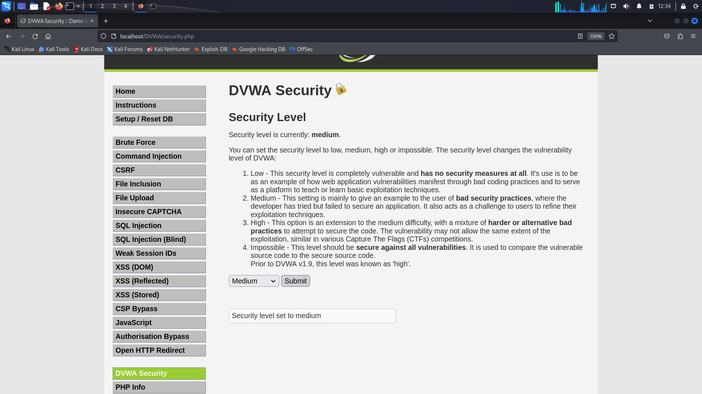

## Daftar Isi Pembahasan Hari Kedua

- [Session Hijacking](#session-hijacking)
- [Cross Site Scripting](#sql-injection)
- [Cross Site Request Forgery](#directory-traversal-vulnerabilities)
- [Man In The Middle](#directory-traversal-vulnerabilities)
- [Man In The Browser](#directory-traversal-vulnerabilities)
- [Insecure Direct Object Reference](#file-inclusion-vulnerabilities)

## Session Hijacking

### Deskripsi
Session hijacking adalah ketika seseorang jahat mencoba mencuri akses ke akun atau informasi online kita dengan cara meretas atau mencuri kode khusus yang digunakan untuk mengidentifikasi kita sebagai pengguna yang sah. Dengan kode ini, mereka bisa mengendalikan akun kita dan melakukan hal-hal yang tidak baik, seperti mencuri data pribadi.

### Metode

- [Physical Access](#physical-access)
- [Session Sidejacking](#session-sidejacking)
- [Session Fixation](#session-fixation)
- [Cross-Site Scripting (XSS)](#cross-site-scripting-xss)
<br>

### Physical Access

Physical access adalah akses fisik atau langsung ke perangkat keras atau tempat di mana data atau sistem komputer tersimpan. Ini berarti seseorang memiliki fisik akses ke perangkat, seperti komputer, server, atau perangkat penyimpanan, dan dapat memanipulasi atau mencuri informasi darinya. 

### Session Sidejacking

Session sidejacking adalah serangan yang terjadi ketika seorang penyerang berhasil mencuri atau mengakses cookie otentikasi dari komputer atau perangkat pengguna yang sah. Cookie adalah potongan kecil data yang disimpan pada perangkat pengguna oleh situs web atau aplikasi untuk mengidentifikasi pengguna yang sah selama sesi online mereka. Dengan mengambil cookie ini, penyerang dapat "mengkloning" sesi pengguna yang sah dan mendapatkan akses yang tidak sah ke akun atau layanan online tersebut.


<br>

### Session Fixation

Session fixation adalah jenis serangan keamanan yang dilakukan dengan cara memanipulasi atau menetapkan ID sesi (session ID) pengguna pada suatu situs web atau aplikasi sebelum pengguna melakukan login atau sesi awal mereka. Penyerang mencoba memaksa pengguna untuk menggunakan ID sesi yang telah mereka tetapkan, yang memungkinkan penyerang untuk mengendalikan atau memonitor sesi pengguna tersebut. Ini dapat digunakan untuk mendapatkan akses tanpa izin ke akun pengguna atau untuk mencuri data pribadi mereka selama sesi. 


<br>

### Pencegahan Session Hijacking

- Penggunaan Secure dan HTTPOnly Flags pada Cookies
  
Memastikan bahwa cookie yang berisi informasi sesi hanya dikirimkan melalui koneksi HTTPS yang aman dan tidak dapat diakses oleh JavaScript dapat membantu melindungi sesi pengguna dari serangan XSS dan serangan man-in-the-middle.

- Penggunaan HTTPS

Menggunakan koneksi HTTPS yang aman adalah langkah kunci dalam melindungi sesi pengguna. Ini mengenkripsi data yang dikirimkan antara server dan peramban pengguna, mengurangi risiko peretasan sesi.

- Pola Nama dan Nilai Cookie yang Acak

Gunakan nama cookie yang sulit ditebak dan nilai yang unik untuk mengurangi risiko serangan session hijacking. Ini membuat lebih sulit bagi penyerang untuk menebak atau menebak cookie sesi pengguna.


## Cross-Site Scripting (XSS)

### Deskripsi

Cross-Site Scripting (XSS) adalah serangan keamanan pada aplikasi web di mana penyerang menyisipkan kode berbahaya ke dalam halaman web yang kemudian akan dieksekusi oleh pengguna yang mengunjungi halaman tersebut. Serangan ini memanfaatkan kurangnya sanitasi atau validasi data yang masuk ke dalam aplikasi web, dan ketika kode berbahaya dieksekusi, penyerang dapat mencuri data pengguna, mengendalikan sesi pengguna, atau merusak tampilan dan fungsionalitas halaman web.

### Jenis

#### Stored XSS

Serangan di mana skrip berbahaya disimpan di server dan dieksekusi ketika pengguna mengakses halaman dengan data tersebut (misalnya, dalam posting forum).

#### Reflected XSS

Serangan di mana skrip berbahaya disertakan dalam permintaan atau tautan yang diberikan kepada korban dan dieksekusi saat korban mengakses tautan atau merespons permintaan tersebut. Serangan ini tidak disimpan di server.


### Identifikasi Kerentanan XSS

- Terjadi ketika sebuah situs web tidak memeriksa data yang dimasukkan oleh pengguna dengan benar sebelum menampilkannya di halaman web.
- Contoh input yang berpotensi berbahaya termasuk karakter khusus seperti `<, >, ', ", {, }, dan ;`. Jika input ini tidak diolah dengan benar, mereka dapat digunakan oleh penyerang untuk menjalankan skrip berbahaya pada peramban pengguna lain.
  
### Contoh Serangan

- Menampilkan Alert Window
Dalam contoh ini, kode disisipkan dalam input pada halaman web. Ketika halaman itu dimuat oleh pengguna lain, alert window dengan pesan "1" akan muncul di peramban mereka. Ini adalah contoh dari serangan XSS yang sederhana.
```
<script>alert(1)</script>
```
- Mencuri Cookies
Dalam contoh ini, kode digunakan untuk mencuri informasi cookie pengguna. Ketika kode ini dieksekusi, jendela peringatan akan muncul dengan daftar cookie pengguna. Penyerang dapat mengambil informasi ini untuk mengakses akun pengguna.
```
<script>alert(document.cookie)</script>
```
- Mengarahkan ke Website Lain
Di sini, kode digunakan untuk mengarahkan pengguna ke situs web Google. Penyerang dapat memanfaatkan ini untuk mengalihkan pengguna ke situs jahat yang mungkin berisi serangan lebih lanjut.
```
<script>window.location='http://www.google.com'</script>
```

### Efek Dari XSS

1. Pencurian Data Sensitif 

2. Mengubah Tampilan dan Isi Dari Website

3. Pemasangan Trojan Horse

4. Mengarahkan Pengguna ke Situs Jahat

### Pencegahan XSS

- Penggunaan htmlentities() PHP Function

Fungsi `htmlentities()` dalam PHP digunakan untuk mengonversi karakter khusus ke dalam entitas HTML sehingga mereka tidak diinterpretasikan sebagai kode HTML atau JavaScript yang berbahaya. Ini membantu dalam mencegah XSS.
```
$input = '<script>alert("XSS Attack")</script>';
$output = htmlentities($input, ENT_QUOTES, 'UTF-8');
echo $output;
// Hasilnya: &lt;script&gt;alert(&quot;XSS Attack&quot;)&lt;/script&gt;
```

- Penggunaan xss_clean() CodeIgniter Function

CodeIgniter adalah kerangka kerja PHP yang memiliki fungsi bawaan `xss_clean()` yang digunakan untuk membersihkan data input dari potensi skrip berbahaya sebelum digunakan atau disimpan dalam database.
```
$data = $this->input->post('input_data');
$clean_data = $this->security->xss_clean($data);
```

- Penggunaan Laravel

Dalam Laravel, sanitasi data dan melindungi dari XSS dapat dicapai dengan berbagai cara, termasuk oleh fitur yang disediakan oleh Laravel sendiri dan dengan menggunakan Blade, mesin template Laravel, yang secara otomatis menghindari XSS.
```
<p>{!! $user_input !!}</p>
```

- Menggunakan if Statement pada CodeIgniter

Pernyataan ini digunakan untuk memeriksa apakah hasil dari `xss_clean()` dalam CodeIgniter mengembalikan `TRUE atau FALSE`. Jika mengembalikan TRUE, itu berarti data mengandung potensi XSS.
```
$file = $this->input->post('file_data');
if ($this->security->xss_clean($file, TRUE) === FALSE) {
    // Data berpotensi XSS
} else {
    // Data aman
}
```

### Penyerangan Dengan DVWA dan XSS

#### Set Up
Penyerangan ini dilakukan dengan DVWA dalam docker. Untuk insialisasinya sebagai berikut:

1. Pastikan docker version adalah 23.0.5 atau terbaru
2. Clone atau download link berikut https://github.com/digininja/DVWA
3. Open terminal dan masuk ke dalam directory DVWA
4. Lakukan run `docker compose up -d`
5. Masuk ke dalam `http://localhost:4280`

#### Langkah - Langkah Penyerangan
1. Saat masuk ke dalam `localhost:4280`, tampilan DVWA akan terlihat seperti berikut.
   
2. Masukkan username, yaitu `admin` dan passwordnya adalah `password`
3. Set up database dengan melakukan klik pada `Create/Reset Database`   
   
4. Setelah itu, pastikan bahwa tingkat kesulitan adalah `Low` dengan cara masuk ke dalam opsi bar `DVWA Security`
   
6. Selanjutnya, pergi ke dalam opsi bar `XSS (Reflected)`. Pada percobaan pertama, diketikkan tulisan "test" pada kolom di samping "What's your name?" dan diikuti klik tombol submit. Hasil dari proses tersebut adalah `Hello test`
   
7. Pada percobaam kedua, dilakukan penyerangan pada DVWA dengan melakukan pengetikan berupa
   ```
   <script>alert("XSS Challenge")</script>
   ```
   pada kolom di samping "What's your name?" dan diikuti klik tombol submit, dan terjadi hasil seperti berikut
   
<br>
<br>

Dari contoh di atas, dapat diketahui serangan XSS kecil yang menampilkan alert window dalam mode low. Untuk selanjutnya merupakan contoh penyerangan dalam mode medium. Langkah - langkah dari penyerangan ini sama seperti pada mode low, namun ada sedikit perbedaan seperti mengubah pengaturan tingkat modenya dari low menjadi medium dan contoh penyerangannya. Berikut merupakan detail dari perbedaan tersebut:

1. Tingkat kesulitan diganti menjadi `medium` pada opsi bar `DVWA Security`
   
2. Lalu pada opsi bar `XSS (Reflected)`, masukkan code untuk penyerangan. Dalam hal ini diketikkan code seperti di bawah ini untuk melakukan penyerangan
   ```
   
   ```
   
3. Setelah itu, klik tombol `submit` dan akan keluar hasil seperti berikut
   

## Cross Site Request Forgery 

### Deskripsi
Cross Site Request Forgery merupakan suatu serangan yang memaksa end user untuk melakukan tindakan yang tidak mereka sadari pada web di mana mereka saat ini sudah terautentikasi (bisa berupa login dengan akun user dan kata sandi atau metode autentikasi lainnya)

### Cara kerja serangan:
1. Dalam GET Scenario:
    - Craft a fake URL:  
    Penyerang menyusun sebuah URL (Uniform Resource Locator) dengan tujuan tertentu untuk membuat korban mengklik link URL tersebut. URL yang dibuat merupakan URL palsu dengan tujuan memanipulasi korban yang dapat menguntungkan pelaku. 
    - Craft a fake image  
    Penyerang dapat mengirimkan fake image ke user yang telah terautentikasi dan image tersebut mengandung kode atau tindakan yang dapat membahayakan user tersebut. Akibatnya, ketika pengguna membuka gambar tersebut, penyerang akan menjalankan tindakan berbahaya tanpa sepengetahuan user. 

2. Dalam POST Scenario:
    - Create a fake (hidden) form:  
    Penyerang membuat beberapa form palsu ataupun form tersembunyi. Contoh aksi yang dilakukan penyerang yaitu aksi pengiriman form ke suatu bank untuk melakukan transfer.
Berikut contoh kodenya:
        ``` Volt
        <form action="http://bank.com/transfer.do" method="POST">
        <input type="hidden" name="acct" value="MARIA"/>
        <input type="hidden" name="amount" value="100000"/>
        <input type="submit" value="View my pictures"/>
        </form>
        ```
### Cara protect websites dari CSRF
1. Menggunakan secret cookie:
   * Kita dapat melindungi situs web dari serangan CSRF dengan menggunakan "Token CSRF"
   * Token CSRF adalah token unik yang dihasilkan oleh server dan disematkan dalam cookie atau dalam tag input tersembunyi dalam form.
   * Token CSRF berperan sebagai "tanda pengenal" yang dikirimkan bersamaan dengan permintaan HTTP dari user. Server kemudian akan memeriksa apakah token tersebut cocok dengan yang diharapkan. Jika tidak cocok atau tidak ada token, maka server akan menolak permintaan tersebut. 
2. Hanya menerima POST requests:
   * Cara lain untuk melindungi situs web dari serangan CSRF adalah dengan hanya mengizinkan operasi yang dapat mengubah data atau status server untuk menggunakan permintaan HTTP POST.
   * POST requests ini dapat membuat penyerang kesulitan untuk memanipulasi tindakan karena tidak bisa mengirimkan permintaan dari situs web yang dikendalikan.
3. Multi-step transactions:
   * Kita dapat memberikan aturan lapisan tambahan keamanan untuk berbagai aksi yang dijalankan oleh user.
   * Contoh:
     Saat user ingin mengubah kata sandi, sistem meminta mereka untuk memasukkan kata sandi saat ini sebelum memperbolehkan mereka untuk membuat perubahan. 
     
4. Menggunakan HTTPS:
   * HTTPS menyediakan enkripsi lalu lintas data antara klien dan server, sehingga sulit bagi penyerang untuk memanipulasi atau membaca data yang ditransfer.
   * HTTPS juga membantu memastikan integritas data yang dikirimkan antara pengguna dan server

### Serangan di DVWA dengan security level low

> Disini, kita gunakan OS Kali Linux  
> Task: Membuat current user untuk mengubah password tanpa mereka ketahui

Cara:
1. Cek IP dari DVWA di vm metasploitable menggunakan command 
```
ifconfig
```
cari ip dengan awalan 192

2. Kita masuk ke website dvwa dengan url `http://ip_dvwa/DVWA/login.php`  
    

3. Kita lakukan login dengan `username: admin` dan `password: password`  

4. Kita set `security level: low`  

   

5. Kita masuk ke tab `CSRF`  

   

6. Disini, kita dapat mengubah password dari current user secara diam-diam dengan memasukkan password baru di `new password` dan konfirmasi di `confirm new password`. Awalnya, password dari user `admin` adalah `password`. Kita coba ubah passwordnya menjadi `123`  

   

7. Saat kita klik tombol change, maka password otomatis keubah. Hal ini dapat kita lihat dari `Test Credentials`  

   

   

8. Hal ini dapat terjadi karena ada beberapa kerentanan. Mari kita bedah satu per satu:   
   a. Kerentanan dari source code saat klik `Change`  
   ``` php
   <?php

   if( isset( $_GET[ 'Change' ] ) ) {
    // Get input
    $pass_new  = $_GET[ 'password_new' ];
    $pass_conf = $_GET[ 'password_conf' ];

    // Do the passwords match?
    if( $pass_new == $pass_conf ) {
        // They do!
        $pass_new = ((isset($GLOBALS["___mysqli_ston"]) && is_object($GLOBALS["___mysqli_ston"])) ? mysqli_real_escape_string($GLOBALS["___mysqli_ston"],  $pass_new ) : ((trigger_error("[MySQLConverterToo] Fix the mysql_escape_string() call! This code does not work.", E_USER_ERROR)) ? "" : ""));
        $pass_new = md5( $pass_new );

        // Update the database
        $current_user = dvwaCurrentUser();
        $insert = "UPDATE `users` SET password = '$pass_new' WHERE user = '" . $current_user . "';";
        $result = mysqli_query($GLOBALS["___mysqli_ston"],  $insert ) or die( '<pre>' . ((is_object($GLOBALS["___mysqli_ston"])) ? mysqli_error($GLOBALS["___mysqli_ston"]) : (($___mysqli_res = mysqli_connect_error()) ? $___mysqli_res : false)) . '</pre>' );

        // Feedback for the user
        echo "<pre>Password Changed.</pre>";
    }
    else {
        // Issue with passwords matching
        echo "<pre>Passwords did not match.</pre>";
    }

    ((is_null($___mysqli_res = mysqli_close($GLOBALS["___mysqli_ston"]))) ? false : $___mysqli_res);} ?> 
    ```

   * Dari kode tersebut, dapat kita lihat bahwa memakai method `GET` yang berarti data dikirim melalui URL.
   * Dari kode tersebut juga, kita dapat langsung melakukan update ketika `new password == configuration password` yang berarti tidak ada security tambahan untuk mengecek kredensial tersebut

   b. Kerentanan dari url akibat method `GET`    
      
      
       
   * Dari link `http://ip_dvwa/DVWA/vulnerabilities/csrf/?password_new=123&password_conf=123&Change=Change#` maka web akan auto update password pada current user.
  
### Serangan di DVWA dengan security level medium

> Disini, kita gunakan OS Kali Linux  
> Task: Membuat current user untuk mengubah password tanpa mereka ketahui. Untuk menembus proteksi pengecekan referer, maka jebakan script harus attacker tanam di website tersebut. Apabila hal tersebut berhasil, maka attacker memiliki referer ke DVWA>  

Cara:

1. Ubah difficulty serangan menjadi medium pada tab `DVWA Security`  



2. Kita masuk ke tab `CSRF`  

   

3. Kita bedah source codenya:  
   ``` php
   <?php

   if( isset( $_GET[ 'Change' ] ) ) {
    // Checks to see where the request came from
    if( stripos( $_SERVER[ 'HTTP_REFERER' ] ,$_SERVER[ 'SERVER_NAME' ]) !== false ) {
        // Get input
        $pass_new  = $_GET[ 'password_new' ];
        $pass_conf = $_GET[ 'password_conf' ];

        // Do the passwords match?
        if( $pass_new == $pass_conf ) {
            // They do!
            $pass_new = ((isset($GLOBALS["___mysqli_ston"]) && is_object($GLOBALS["___mysqli_ston"])) ? mysqli_real_escape_string($GLOBALS["___mysqli_ston"],  $pass_new ) : ((trigger_error("[MySQLConverterToo] Fix the mysql_escape_string() call! This code does not work.", E_USER_ERROR)) ? "" : ""));
            $pass_new = md5( $pass_new );

            // Update the database
            $current_user = dvwaCurrentUser();
            $insert = "UPDATE `users` SET password = '$pass_new' WHERE user = '" . $current_user . "';";
            $result = mysqli_query($GLOBALS["___mysqli_ston"],  $insert ) or die( '<pre>' . ((is_object($GLOBALS["___mysqli_ston"])) ? mysqli_error($GLOBALS["___mysqli_ston"]) : (($___mysqli_res = mysqli_connect_error()) ? $___mysqli_res : false)) . '</pre>' );

            // Feedback for the user
            echo "<pre>Password Changed.</pre>";
        }
        else {
            // Issue with passwords matching
            echo "<pre>Passwords did not match.</pre>";
        }
    }
    else {
        // Didn't come from a trusted source
        echo "<pre>That request didn't look correct.</pre>";
    }

    ((is_null($___mysqli_res = mysqli_close($GLOBALS["___mysqli_ston"]))) ? false : $___mysqli_res);}?> 
   ```

    * Jadi, saat button `Change` di klik, maka method `GET` akan bekerja. Disini, terdapat if else condition.
    * Dalam If else condition tersebut, kita gunakan fungsi php `stripos()` untuk mencari substring dalam sebuah string. Kita cek substring dari `HTTP_REFERER` apakah sama dengan substring dari `SERVER_NAME` yang sesuai.
    * HTTP REFERER: Berisi URL halaman sebelumnya yang mengarah ke halaman saat ini. 
    * `SERVER_NAME` yang sesuai dapat kita cek dari `PHP Info`  
      

4. Untuk melakukan attack, kita gunakan user lain. Misal, kita gunakan `User: pablo` dengan `password: letmein`

    * Dengan user `pablo`, kita menuju tab `XSS (Stored)`  
      

    * Disini, kita lakukan inspect element pada input text dari `name` lalu kita hapus `MAX_LENGTH`  
      

    * Kita masukkan syntax ini di dalam input text dari `Name`  
      ```
      
      ```
    * Lalu, kita masukkan message berupa "Message"  
      

    * Setelah itu, kita klik button `Sign Guestbook`  
      
5. Kita kembali ke `user: admin` dengan password yang terakhir kali kita ubah. 
   > Misal, kita terakhir melakukan pengujian CSRF untuk level low dan kita ganti passwordnya menjadi '123', maka masukkan angka '123' ke password dari user 'admin'. 

   * Disini, kita dapat terkena attack ketika kita masuk ke tab `XSS (Stored)`    
     
   * Lalu, kita masuk ke tab `CSRF`. Apabila kita cek kredensial dengan `user: admin` dan password yang terakhir kali kita ubah sebelum terkena serangan CSRF level medium, maka hasilnya:  
     
   * Apabila kita masukkan password dengan password yang telah diubah dengan user pablo yaitu `password: hack`, maka:  
     

## Man-in-the-middle Attack


Man in the Middle Attack, atau dapat disingkat MitM, adalah salah satu jenis _cyber attack_ yang bekerja dengan cara 'menyusup' ke dalam jaringan dan menyadap komunikasi yang sedang berlangsung antara pengguna jaringan dan web server tujuan.

Serangan ini dapat dilakukan dengan cara-cara sebagai berikut:

1. Menggunakan arpspoof tool.

```
arpspoof –i <interface> -t <victim IP> <router IP>
```

2. Rekam lalu lintas jaringan menggunakan Wireshark.

Lantas, bagaimana kita tau bahwa kita telah menjadi korban MitM? Beberapa hal yang dapat kita lakukan untuk mengetahuinya adalah sebagai berikut:

1. Cari respons paket ARP yang tidak biasa.
2. Biasanya, banyak lompatan antara paket masuk dan keluar berbeda.
3. Gunakan HTTPS.

## Man-in-the-browser Attack

Man-in-the-browser (MitB) memiliki pendekatan yang sama dengan MitM. Namun, dalam MitB, _Trojan Horse_ digunakan untuk menyusup dan memanipulasi panggilan antara aplikasi utama yang dapat dijalankan (misal browsernya) dan mekanisme keamanannya maupun library-nya secara langsung.

Berikut adalah beberapa cara yang dapat dilakukan untuk menghindari serangan MitB:

1. Jangan meng-_install_ ekstensi browser yang tidak terverifikasi.
2. Jangan meng-_install_ DLL, driver, maupun aplikasi yang tidak terverifikasi.

